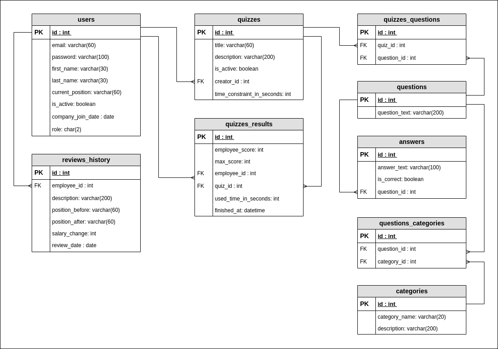

# Employees Management System (backend part)

<h3>Description</h3>

<h3>Used technologies</h3>
<dl>
  <li>Django + Django REST Framework</li>
</dl>

<h3>Database scheme</h3>

<h3>Requirements</h3>

<h3>How to run application</h3>

<h3>How to run tests</h3>

